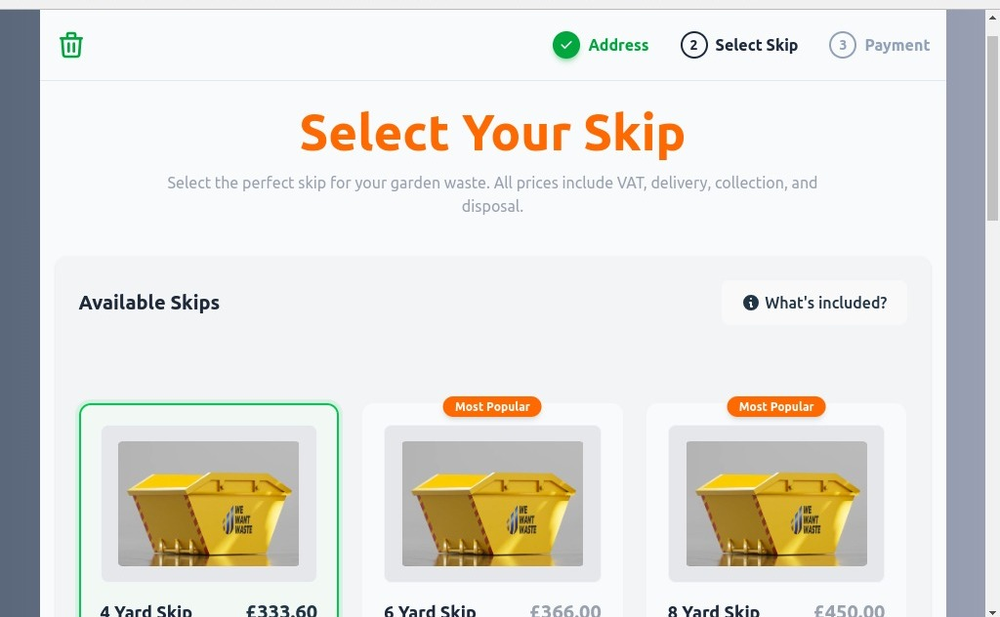

# Skip Selection Page Redesign

A modern, responsive redesign of the We Want Waste skip selection page, built with React + Vite. This project demonstrates clean UI/UX principles, responsive design, and maintainable code architecture.

## 🚀 Live Demo

[View Live Demo](https://skip-selector-redesign-sand.vercel.app/)

## 📸 Screenshots

### Desktop View




## 🎯 Project Overview

This project is a complete redesign of the skip selection page from [We Want Waste](https://wewantwaste.co.uk/). The goal was to create a modern, user-friendly interface while maintaining all original functionality.

## 🛠️ Tech Stack

- **React 19** - UI library
- **Vite** - Build tool and dev server
- **Tailwind CSS** - Utility-first CSS framework
- **JavaScript ES6+** - Modern JavaScript features
- **Fetch API** - Data fetching from provided endpoint

## ✨ Features

### UI/UX Improvements

- ✅ **Clean, Professional Design** - Light theme appropriate for waste management services
- ✅ **Responsive Grid Layout** - Adapts from 1 column (mobile) to 3 columns (desktop)
- ✅ **Visual Feedback** - Clear selection states with green borders and backgrounds
- ✅ **Progress Indicator** - Step-by-step visual progress through booking process
- ✅ **Information Architecture** - Organized layout with clear sections
- ✅ **Interactive Elements** - Hover states, smooth transitions, and animations

### Technical Features

- ✅ **Component-Based Architecture** - Reusable, maintainable components
- ✅ **API Integration** - Live data from provided endpoint
- ✅ **Error Handling** - Graceful error states with user feedback
- ✅ **Loading States** - Smooth loading experience
- ✅ **Data Enhancement** - Enriched API data with descriptions and dimensions
- ✅ **Accessibility** - Semantic HTML and ARIA considerations

## 🚦 Getting Started

### Prerequisites

- Node.js (v14 or higher)
- npm or yarn

### Installation

1. Clone the repository

```bash
git clone https://github.com/Nondumison/skip-selection-redesign.git
cd skip-selection-redesign
```

2. Install dependencies
   `npm install`

3. Create .env file in root directory
   `VITE_API_URL=https://app.wewantwaste.co.uk/api/skips/by-location?postcode=NR32&area=Lowestoft`

4. Start development server
   ` npm run dev`

### Testing

Run unit tests:
`npm run test`

Run tests with coverage:
`npm run test:coverage`

## 🤝 Contributing

This is a technical assessment project, but feedback and suggestions are welcome!

## 👨‍💻 Author

**Nondumiso**

- GitHub: [Nondumison](https://github.com/Nondumison)
- LinkedIn: [Nondumiso](https://www.linkedin.com/in/nondumiso-nkosi/)

## 📄 License

This project is created for assessment purposes.
